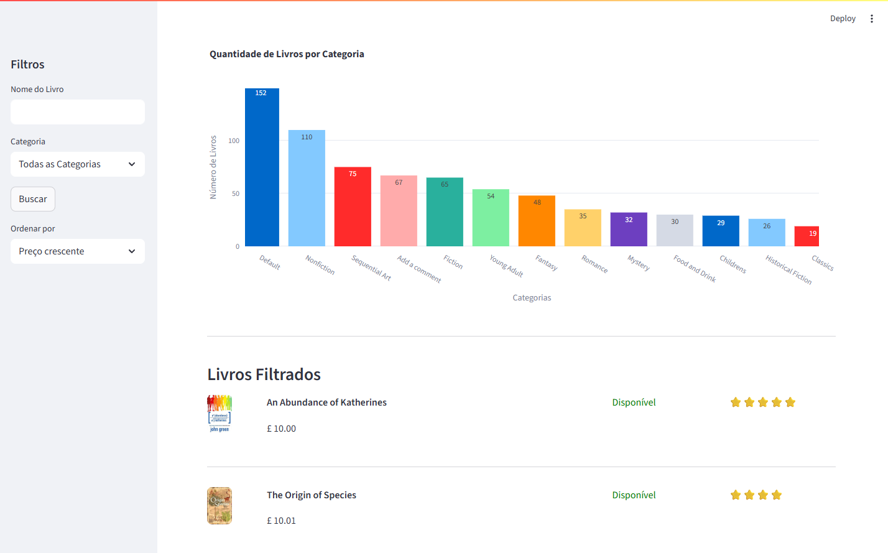

# Tech Challenge ENG. Machine Learning - Scrapper Livros + Pipeline de dados

Uma API RESTful baseada em FastAPI para consulta de livros, categorias, previsões de machine learning e cadastro de usuários. Os dados disponíveis para essa API foram extraídos do site [books.toscrape](https://books.toscrape.com/).

## Funcionalidades

- 📚 Busca e filtragem de livros e suas categorias
- 👤 Autenticação de usuários (JWT)
- 📊 Endpoints de estatísticas (visão geral, categorias)
- 🤖 Endpoints de Machine Learning (features, dados de treino, previsões)
- 🩺 Endpoint de helth check
- 🖥️ Scraper de livros do site [books.toscrape](https://books.toscrape.com/)

## Tecnologias

- Python 3.12+
- FastAPI
- SQLAlchemy
- Pydantic
- UV (gerenciador de projeto)
- SQLite
- Docker
- BeautifulSoup

## Estrutura do Projeto

```
tc-ml-books/
├── dashboard/         # Dashboard para análise de dados
├── docs/              # Outras documentações, plano arquitetural
├── pipelines/         # CI/CD, GitHub Actions 
├── src/
│   ├── api/           # Handlers das rotas FastAPI
│   ├── core/          # Utilitários, configuração, segurança
│   ├── crud/          # Lógica de acesso ao banco de dados
│   ├── data/          # Arquivos gerados pelo scrape
│   ├── middlewares/   # Centralização logs
│   ├── models/        # Modelos SQLAlchemy
│   ├── schemas/       # Schemas Pydantic
│   ├── scripts/       # Scripts para scraper e carga inicial da base
│   └── main.py        # Ponto de entrada da aplicação FastAPI
├── Dockerfile
├── pyproject.toml     # Dependências do projeto
├── README.md
└── ...
```

## Primeiros Passos

### 1. Clone o repositório

```bash
git clone https://github.com/seu-usuario/tc-ml-books.git
cd tc-ml-books
```

### 2. Instale as dependências

#### 2.1. Instalar UV
```bash
pip install uv
```
Outros formas de instalação: [Documentação UV](https://docs.astral.sh/uv/getting-started/installation/).

#### 2.2. Instalação das dependências utilizando comandos UV
Linux
```bash
uv venv
source .venv/bin/activate
uv pip sync pyproject.toml
```
Windows
```bash
uv venv
.\venv\Scripts\activate
uv pip sync pyproject.toml
```

### 3. Configure as variáveis de ambiente

Crie um arquivo `.env` na raiz do projeto:

```
DATABASE_URL=sqlite:///./nome-banco.db
SECRET_KEY=sua-chave-secreta
```

### 4. Execute as migrações do banco de dados

```bash
alembic upgrade head
```

### 5. Inicie a API

```bash
uv run uvicorn main:app --reload
```

A API estará disponível em [http://localhost:8000](http://localhost:8000).

## Documentação da API

Documentação disponível em:

- [Swagger UI](http://localhost:8000/docs)
- [ReDoc](http://localhost:8000/redoc)

## Exemplos de Uso

### Listar todos os livros

```http
GET /api/books/
```

### Obter estatísticas dos livros

```http
GET /api/stats/overview
```

### Obter features de ML para um livro

```http
GET /api/ml/features/{book_id}
```

## Docker (opcional)

Construa e rode com Docker:

```bash
docker build -t tc-ml-books .
docker run -p 8000:8000 tc-ml-books
```

## Executando Scripts de Scraper e Seed

### 1. Rodar o Scraper

O script de scraper coleta os dados de livros do site [books.toscrape](https://books.toscrape.com/) e salva em um arquivo na pasta `src/data/`. Um arquivo de log `log_scraping.txt` é gerado, detalhando sua execução.

Execute o comando:

```bash
uv run python src/scripts/bookstoscrape_scraper.py
```

### 2. Rodar o Seed (Carga Inicial)

Após rodar o scraper, utilize o script de seed para popular o banco de dados com os dados coletados:

```bash
uv run -m src.scripts.seed
```
Um arquivo de log `log_seed.txt` é gerado, detalhando sua execução.

Certifique-se de que as variáveis de ambiente estejam configuradas e que o ambiente virtual esteja ativado antes de executar os scripts.

`Obs`.: ao rodar o script, todos os registros de livros e categorias são apagados antes dos novos serem inseridos.

## Dashboard
Dashboard interativo construído com `Streamlit` para exploração da base de livros. A aplicação foi projetada para consumir a API RESTful buscando dados em tempo real e garantindo o acesso através de uma tela de login segura. Dessa forma, para rodar o dashboard, a API deverá estar em execução.

Execute o comando:

```bash
uv run uvicorn main:app --reload # Necessário api estar em execução
streamlit run dashboard/app.py 
```
Demonstração do Dashboard


---

