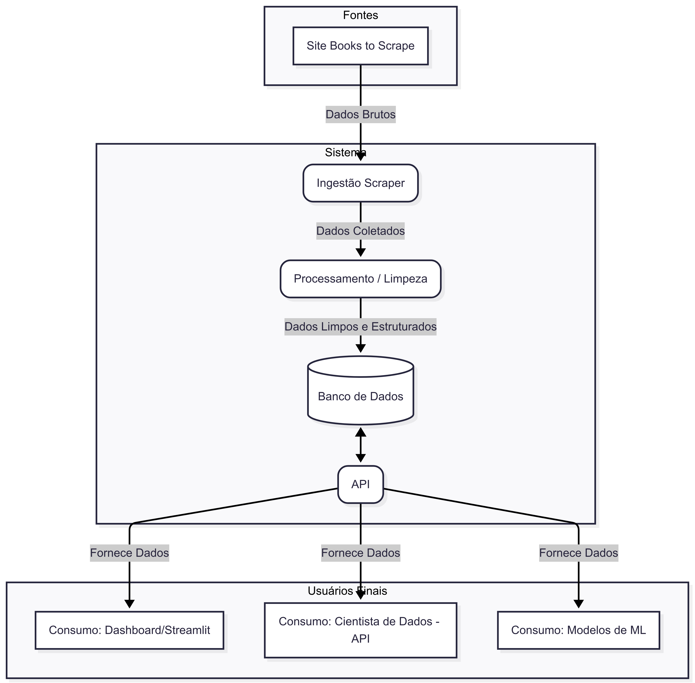

# Plano Arquitetural

Este documento descreve a arquitetura da aplicação **Tech Challenge ML Books**, detalhando os principais componentes, fluxos de dados, tecnologias utilizadas e diretrizes para escalabilidade e integração com Machine Learning.

## Visão Geral

A aplicação é composta por uma API RESTful desenvolvida em FastAPI, responsável por gerenciar livros, categorias, usuários e previsões de machine learning. O sistema utiliza um banco de dados local para persistência dos dados e integra um pipeline de scraping para alimentar a base de livros.

## Diagrama Arquitetural

## Componentes Principais

- **API FastAPI**  
  Expõe endpoints REST para consultas de livros, categorias, estatísticas,machine learning e cadastro de usuários. 

- **Banco de Dados (SQLite)**  
  Armazena informações sobre livros, categorias, usuários e previsões.

- **Scraper**  
  Coleta dados do site [books.toscrape.com](https://books.toscrape.com/) para posteriormente alimentar o banco de dados.

- **Camada CRUD**  
  Implementa a lógica de acesso e manipulação dos dados no banco, separando regras de negócio das rotas.

- **Schemas (Pydantic)**  
  Define contratos de entrada e saída dos dados da API, garantindo validação e tipagem.

- **Autenticação JWT**  
  Garante a segurança dos endpoints protegidos, permitindo apenas o acesso de usuários autenticados.

- **Endpoints de Machine Learning**  
  Disponibilizam features, dados de treino e previsões de preço para livros.

- **Dashboard Interativo de Análise de Dados**  
  Exploração e visualização dos dados coletados em um dashboard interativo utilizando a biblioteca Streamlit.

## Arquitetura para Escalabilidade Futura

- **Separação de responsabilidades:** Cada camada (API, CRUD, modelos, schemas) é modular, facilitando manutenção e expansão.
- **Banco de dados relacional escalável:** Possibilidade de fácil migração para outros bancos, como o PostgreSQL ou MySQL, pensando em um cenário produtivo.
- **Containerização:** Uso de Docker para facilitar deploy em ambientes escaláveis.
- **Pronto para orquestração:** Estrutura pronta para CI/CD, já contendo uma configuração inicial de pipeline de injestão de dados utilizando GitHub Actions, garantindo atualização contínua da base de livros, sem depender de execução manual, e facilitando a rastreabilidade das coletas realizadas.
- **Observabilidade:** Logs estruturados em todos os requests e scripts, gerando maior rastreabilidade e possibilitando de integração com painéis como Datadog ou Kibana.

## Cenário de Uso para Cientistas de Dados/ML

- **Acesso facilitado aos dados:** Endpoints específicos para exportação de dados de livros em formatos adequados para análise e treinamento de modelos.
- **Streaming de dados:** Possibilidade de consumir grandes volumes de dados via streaming, evitando sobrecarga de memória.
- **Features de ML:** Endpoints que expõem features já processadas dos livros, facilitando experimentação e prototipagem de modelos.
- **Previsões via API:** Cientistas de dados podem consultar previsões de preço de livros diretamente pela API, integrando facilmente com notebooks e pipelines externos.

## Plano de Integração com Modelos de ML

- **Exportação de dados para treinamento:** Endpoint `/ml/training-data` permite exportar dados em formato JSON Lines, pronto para uso em pipelines de ML.
- **Endpoint de Features de ML:** O endpoint `/ml/features` disponibiliza dados formatados de um determinado livro, prontos para uso em experimentação e prototipagem de modelos.
- **Versionamento de modelos:** Possibilidade de registrar e consultar a versão do modelo utilizado em cada previsão, garantindo rastreabilidade.
- **Logs e métricas:** Estrutura pronta para coletar logs de uso e métricas de performance dos modelos, facilitando monitoramento e melhoria contínua.

## Fluxo de Dados

1. **Coleta de Dados:**  
  Scraper local para coleta de coleta de dados e injestão no banco de dados. 

2. **Consumo da API:**  
   Usuários autenticados podem consultar, filtrar e buscar livros, além de acessar estatísticas e previsões de ML.

3. **Machine Learning:**  
   Dados dos livros podem ser exportados para treinamento de modelos. Previsões podem ser registradas via API.

## Tecnologias Utilizadas

- **FastAPI** para a API REST
- **SQLAlchemy** para ORM
- **Pydantic** para validação de dados
- **SQLite** como banco de dados
- **BeautifulSoup** para scraping
- **JWT** para autenticação
- **Docker** (opcional) para containerização

---

Este plano deve ser revisado e expandido conforme a evolução do projeto, especialmente para detalhar integrações, escalabilidade e desempenho. É importante revisar e atualizar este documento periodicamente para refletir mudanças na arquitetura ou na tecnologia utilizada.